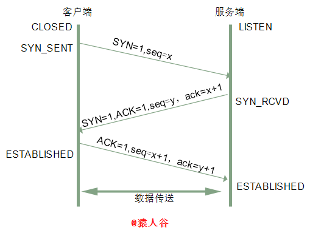
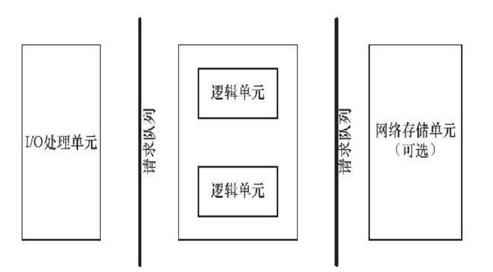
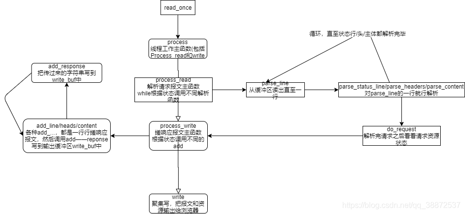
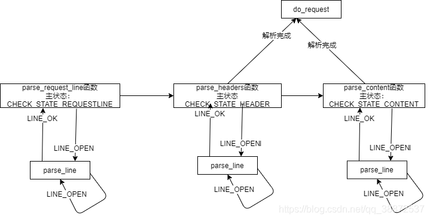
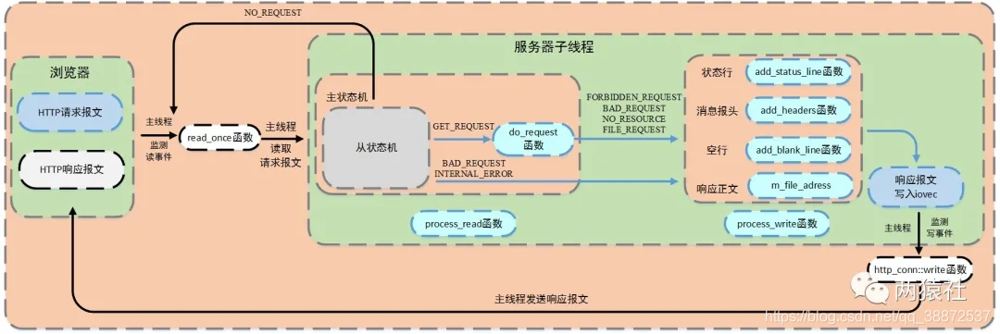

# TinyWebServer

## 1 基础知识
要开始这个项目，需要对linux编程、网络编程有一定的了解，这方面书籍推荐《Unix网络编程》和《Linux高性能服务器编程》。

### 什么是web sever？
Web服务器一般指网站服务器，是指驻留于因特网上某种类型计算机的程序，可以处理浏览器等Web客户端的请求并返回相应响应——可以放置网站文件，让全世界浏览；可以放置数据文件，让全世界下载。目前最主流的三个Web服务器是Apache、 Nginx 、IIS。服务器与客户端的关系如下：

​在本项目中，web请求主要是指HTTP协议，有关HTTP协议知识可以[参考介绍](https://www.cnblogs.com/an-wen/p/11180076.html)，HTTP基于TCP/IP，进一步了解请百度。

### 什么是socket？
客户端与主机之间是如何通信的？——[Socket](https://blog.csdn.net/weixin_39258979/article/details/80835555?ops_request_misc=%257B%2522request%255Fid%2522%253A%2522166795863616782428627691%2522%252C%2522scm%2522%253A%252220140713.130102334..%2522%257D&request_id=166795863616782428627691&biz_id=0&utm_medium=distribute.pc_search_result.none-task-blog-2~all~top_positive~default-1-80835555-null-null.142^v63^control,201^v3^control_2,213^v2^t3_esquery_v2&utm_term=Socket&spm=1018.2226.3001.4187)

socket起源于Unix，而Unix/Linux基本哲学之一就是“一切皆文件”，都可以用“打开open –> 读写write/read –> 关闭close”模式来操作。Socket就是该模式的一个实现，socket即是一种特殊的文件，一些socket函数就是对其进行的操作（读/写IO、打开、关闭），我们以下客户端获取服务端的时间的例子，来理解socket的使用过程：

### 服务器端代码
```c++
// 《unix网络编程》的公共头文件
#include	"unp.h"
#include	<time.h>
int main(int argc, char **argv)
{
	int					listenfd, connfd;
	struct sockaddr_in	servaddr;
	char				buff[MAXLINE];
	time_t				ticks;
    // 创建socket套接字文件描述符
	listenfd = Socket(AF_INET, SOCK_STREAM, 0); 
	bzero(&servaddr, sizeof(servaddr));
	servaddr.sin_family      = AF_INET;
    // 将套接字绑定到所有可用的接口
    // 注htol是主机序转网络字节序，请百度了解
	servaddr.sin_addr.s_addr = htonl(INADDR_ANY);
	servaddr.sin_port        = htons(13);	
    // 绑定该socket和地址
	Bind(listenfd, (SA *) &servaddr, sizeof(servaddr));
    // 服务器开始监听这个端口上（创建监听队列）
	Listen(listenfd, LISTENQ);
    // 服务器处理代码
	for ( ; ; ) {
        // 从监听队列中，取出一个客户端连接
		connfd = Accept(listenfd, (SA *) NULL, NULL);
        ticks = time(NULL);
        snprintf(buff, sizeof(buff), "%.24s\r\n", ctime(&ticks));
        Write(connfd, buff, strlen(buff));
		Close(connfd);
	}
}
```
### 客户端程序
```c++
// 《unix网络编程》的公共头文件
#include "unp.h"
int main(int argc, char **argv)
{
	int					sockfd, n;
	char				recvline[MAXLINE + 1];
	struct sockaddr_in	servaddr;
	if (argc != 2)
		err_quit("usage: a.out <IPaddress>");
    // 创建客户端socket
	if ( (sockfd = socket(AF_INET, SOCK_STREAM, 0)) < 0)
		err_sys("socket error");

	bzero(&servaddr, sizeof(servaddr));
	servaddr.sin_family = AF_INET;
	servaddr.sin_port   = htons(13);	/* daytime server */
	if (inet_pton(AF_INET, argv[1], &servaddr.sin_addr) <= 0)
		err_quit("inet_pton error for %s", argv[1]);
    //尝试连接对应地址的服务器端口
	if (connect(sockfd, (SA *) &servaddr, sizeof(servaddr)) < 0)
		err_sys("connect error");
    // 读取socket中的内容
	while ( (n = read(sockfd, recvline, MAXLINE)) > 0) {
		recvline[n] = 0;	/* null terminate */
		if (fputs(recvline, stdout) == EOF)
			err_sys("fputs error");
	}
	if (n < 0)
		err_sys("read error");
	exit(0);
}
```

### TCP服务器与TCP客户端的工作流程见下：
三次握手（Three-way Handshake）其实就是指建立一个TCP连接时，需要客户端和服务器总共发送3个包。进行三次握手的主要作用就是为了确认双方的接收能力和发送能力是否正常、指定自己的初始化序列号为后面的可靠性传送做准备。实质上其实就是连接服务器指定端口，建立TCP连接，并同步连接双方的序列号和确认号，交换TCP窗口大小信息。

刚开始客户端处于 Closed 的状态，服务端处于 Listen 状态。进行三次握手：

- 第一次握手：客户端给服务端发一个 SYN 报文，并指明客户端的初始化序列号 ISN。此时客户端处于 SYN_SENT 状态。
(首部的同步位SYN=1，初始序号seq=x，SYN=1的报文段不能携带数据，但要消耗掉一个序号。)
- 第二次握手：服务器收到客户端的 SYN 报文之后，会以自己的 SYN 报文作为应答，并且也是指定了自己的初始化序列号 ISN(s)。同时会把客户端的 ISN + 1 作为ACK 的值，表示自己已经收到了客户端的 SYN，此时服务器处于 SYN_RCVD 的状态。
(在确认报文段中SYN=1，ACK=1，确认号ack=x+1，初始序号seq=y。)
- 第三次握手：客户端收到 SYN 报文之后，会发送一个 ACK 报文，当然，也是一样把服务器的 ISN + 1 作为 ACK 的值，表示已经收到了服务端的 SYN 报文，此时客户端处于 ESTABLISHED 状态。服务器收到 ACK 报文之后，也处于 ESTABLISHED 状态，此时，双方已建立起了连接。
(确认报文段ACK=1，确认号ack=y+1，序号seq=x+1（初始为seq=x，第二个报文段所以要+1），ACK报文段可以携带数据，不携带数据则不消耗序号。)

发送第一个SYN的一端将执行主动打开（active open），接收这个SYN并发回下一个SYN的另一端执行被动打开（passive open）。在socket编程中，客户端执行connect()时，将触发三次握手。
​ 

如果有多个客户端都想connect服务器，那么服务器如何对这些客户端进行处理？这就需要介绍一下IO复用。

### IO复用是什么？
IO复用指的是在单个进程中`通过记录跟踪每一个Socket(I/O流)的状态来同时管理多个I/O流`. 发明它的原因，是尽量多的提高服务器的吞吐能力，参考链接。

如上文所说，当多个客户端与服务器连接时，这就涉及如何“同时”给每个客户端提供服务的问题。服务器的基本框架如下：

​ 
图中的逻辑单元，就是上例中“写入服务器时间”这一功能。要解决多客户端连接的问题，首先得有一个队列来对这个连接请求进行排序存放，而后需要通过并发多线程的手段对已连接的客户进行应答处理。

本项目是利用epollIO复用技术实现对监听socket（listenfd）和连接socket（客户请求连接之后的socket）的同时监听。注意I/O复用虽然可以同时监听多个文件描述符，但是它本身是阻塞的，所以为提高效率，这部分通过线程池来实现并发，为每个就绪的文件描述符分配一个逻辑单元（线程）来处理。

### Unix有五种基本的IO模型：

- 阻塞式IO（守株待兔）
- 非阻塞式IO（没有就返回，直到有，其实是一种轮询（polling）操作）
- O复用（select、poll等，使系统阻塞在select或poll调用上，而不是真正的IO系统调用（如recvfrom），等待select返回可读才调用IO系统，其优势就在于可以等待多个描述符就位）
- 信号驱动式IO（sigio，即利用信号处理函数来通知数据已完备且不阻塞主进程）
- 异步IO（posix的aio_系列函数，与信号驱动的区别在于，信号驱动是内核告诉我们何时可以进行IO，而后者是内核通知何时IO操作已完成）

### 对于到来的IO事件（或是其他的信号/定时事件），又有两种事件处理模式：

- Reactor模式：要求主线程（I/O处理单元）只负责监听文件描述符上是否有事件发生（可读、可写），若有，则立即通知工作线程，将socket可读可写事件放入请求队列，读写数据、接受新连接及处理客户请求均在工作线程中完成。(需要区别读和写事件)
- Proactor模式：主线程和内核负责处理读写数据、接受新连接等I/O操作，工作线程仅负责业务逻辑（给予相应的返回url），如处理客户请求。
通常使用同步I/O模型（如epoll_wait）实现Reactor，使用异步I/O（如aio_read和aio_write）实现Proactor，但是异步IO并不成熟，本项目中使用同步IO模拟proactor模式。有关这一部分的进一步介绍请参考第四章、线程池。

### PS：什么是同步I/O，什么是异步I/O呢？

- 同步（阻塞）I/O：等待IO操作完成，才能继续进行下一步操作。这种情况称为同步IO。
- 异步（非阻塞）I/O：当代码执行IO操作时，它只发出IO指令，并不等待IO结果，然后就去执行其他代码了。一段时间后，当IO返回结果时（内核已经完成数据拷贝），再通知CPU进行处理。（异步操作的潜台词就是你先做，我去忙其他的，你好了再叫我）

IO复用需要借助select/poll/epoll，本项目之所以采用epoll，参考问题（Why is epoll faster than select?）

- 对于select和poll来说，所有文件描述符都是在用户态被加入其文件描述符集合的，每次调用都需要将整个集合拷贝到内核态；epoll则将整个文件描述符集合维护在内核态，每次添加文件描述符的时候都需要执行一个系统调用。系统调用的开销是很大的，而且在有很多短期活跃连接的情况下，epoll可能会慢于select和poll由于这些大量的系统调用开销。
- select使用线性表描述文件描述符集合，文件描述符有上限；poll使用链表来描述；epoll底层通过红黑树来描述，并且维护一个ready list，将事件表中已经就绪的事件添加到这里，在使用epoll_wait调用时，仅观察这个list中有没有数据即可。
- select和poll的最大开销来自内核判断是否有文件描述符就绪这一过程：每次执行select或poll调用时，它们会采用遍历的方式，遍历整个文件描述符集合去判断各个文件描述符是否有活动；epoll则不需要去以这种方式检查，当有活动产生时，会自动触发epoll回调函数通知epoll文件描述符，然后内核将这些就绪的文件描述符放到之前提到的ready list中等待epoll_wait调用后被处理。
- select和poll都只能工作在相对低效的LT模式下，而epoll同时支持LT和ET模式。
综上，当监测的fd数量较小，且各个fd都很活跃的情况下，建议使用select和poll；当监听的fd数量较多，且单位时间仅部分fd活跃的情况下，使用epoll会明显提升性能。

### 其中提到的LT与ET是什么意思？

- LT是指电平触发（level trigger），当IO事件就绪时，内核会一直通知，直到该IO事件被处理；
- ET是指边沿触发（Edge trigger），当IO事件就绪时，内核只会通知一次，如果在这次没有及时处理，该IO事件就丢失了。

### 什么是多线程？
上文提到了并发多线程，在计算机中程序是作为一个进程存在的，线程是对进程的进一步划分，即在一个进程中可以有多个不同的代码执行路径。相对于进程而言，线程不需要操作系统为其分配资源，因为它的资源就在进程中，并且线程的创建和销毁相比于进程小得多，所以多线程程序效率较高。

但是在服务器项目中，如果频繁地创建/销毁线程也是不可取的，这就引入了线程池技术，即提前创建一批线程，当有任务需要执行时，就从线程池中选一个线程来进行任务的执行，任务执行完毕之后，再将该线程丢进线程池中，以等待后续的任务。


## 2 项目学习

学习方式：
- 代码架构，每一个目录负责什么模块（这个部分可以结合开源项目的文档，可以加快对项目的理解速度）
- 编译运行，看看有什么功能；
- 挑某一个功能，细究其代码实现，我就先挑“用户登录注册”功能来进行研究，再考虑其他的功能；
- 添加功能。

### 项目的代码框架


### 2.1 main模块
#### [config.cpp代码解读](../WebServer/config.cpp)
- 在构造函数里作出了对于各种初始模式的设定
- 对于并发模式的处理，作者给出了reactor和preactor两种方式。
总结： 简单的初始化形式的分割，改动参数的时候我只需要改动config.cpp就行了
`getopt(argc, argv, str)函数是命令行参数解析函数`

#### [main.cpp代码解读](../WebServer/main.cpp)
- 这里的命令行解析是给数据库的运行方式传参，当然你可以什么都不传。
- 定义，之后初始化了一个服务器对象。
- 首先打开线程池，然后设置运行模式，之后就是启动监听和进入工作循环（事务循环）

### 2.2 Webserver模块
[Webserver代码](../WebServer/webserver.cpp)

#### 1) trig_mode函数
4种模式的分配：`LT + LT, LT + ET, ET + LT, ET + ET`

#### 2) log_write函数

#### 3) sql_pool函数

#### 4) thread_pool函数

#### 5) eventListen函数
- 简单的民工三连调用不需要解释，作者加入了assert，提升了健壮性。
- 之后就是调用epoll的三连了，将监听套接字lfd上树，这里的上树封装为了addfd(加入文件描述符), 目的是为了可以更改模式。（cfd需要one_shot而lfd不需要）
- - lfd就是服务器端用于监听有没有客户端连接的套接字，或者说监听有没有来自客户端的connect()；
- - 而cfd就是负责连接客户端，看看有没有来自客户端的read() / write()这种I/O请求。
- - 只有先lfd监听到客户端的连接请求，然后答应连接accept()，才会创建出cfd
- 之后就是创建了管道，这里牵扯到进程间通信的问题。这么做的好处就是统一事件源。因为正常情况下，信号处理与IO处理不走一条路。
这里的信号主要是超时问题
- 具体的做法是，信号处理函数使用管道将信号传递给主循环，信号处理函数往管道的写端写入信号值，主循环则从管道的读端读出信号值，使用I/O复用系统调用来监听管道读端的可读事件，这样信号事件与其他文件描述符都可以通过epoll来监测，从而实现统一处理。


#### 6) eventLoop函数
这个函数可以说是始终伴随着程序始终。只要服务器不关，我就一直不退出，因为我退出了，main也退出了。
明显看出，这一函数的逻辑就是不断的处理产生事件的节点（思考一下这里为什么这么叫）。
而在epoll_wait返回后，我们主要处理三种事件：io事件，信号，新的连接
也就是在for循环中的三次判断，并且每次处理完一组后，我们会刷新定时。


### 2.3 threadpool模块
[threadpool代码](../WebServer/threadpool/threadpool.h)
#### 1) 设计思路
一个web服务器几乎离不开多线程了，在main那里我们说到main把所有读时间能读到的数据都存放在客户读缓冲区中，然后就插入任务到任务队列等待线程去完成。

线程池类有两个最为关键的成员：
- pthread_t* m_threads; // 线程池数组
- std::list<T*> m_workqueue; // 请求队列

我们在WebServer中调用append_p和append函数（区别是lfd和cfd，因为这里有模式问题）把新任务放到list的尾部，然后所有线程争夺list中的任务（这里要使用条件变量），争夺到的线程先对任务队列加互斥锁，然后从list头取出任务结构体，在这个任务结构体内有一个回调函数，这个函数就是真正的工作（包括解析http请求报文，对请求资源的检查，搓响应报文一条龙）。当然这个函数我们放在http模块以更加模块化，从线程的角度就是我们拿到任务然后调用这个函数，线程就是在漫长的这个函数中度过了。

然后是线程池数组，这个线程池还是比较简单的线程池（没有对线程的动态删减等等），那么我们就是在线程池构造的时候就创建好约定个数的线程储存在线程数组里，并且把线程detach掉，这样我们就不需要对线程进行回收等等操作。线程的关键是线程的工作函数run()，这个函数不断while循环直到被条件变量唤醒然后上锁从list头取出任务，开始执行任务。

#### 2) 代码详解
你可以当做这是一个标准的线程池写法。
在之前的WebServer中，我们对线程池函数没有讲解。在这里我们讲一下为什么这样写。
```c++
void WebServer::thread_pool()
{
    //线程池
    m_pool = new threadpool<http_conn>(m_actormodel, m_connPool, m_thread_num);
}
```

1. 构造函数完成线程池的初始化，产生了8个线程并且作出了分离
2. m_poll这个指针可以调用append函数来完成将事件入队的任务
3. http_conn给到了一个入口的作用，通过等待信号量来进入到http类里写出的process函数完成对于事务的处理。
意味着以上三步走之后，半同步/半反应堆的模式达成。左侧有嗷嗷待哺的线程，右侧有反应堆。
原作者的代码中没有涉及惊群效应

#### 3) preactor与reactor
同样，这里在run函数中给出了两种模式的不同处理，在preactor模式下，同步线程处理两种任务逻辑。
这里说一下为什么是两种，首先信号任务由主线程完成，其次如果wait监听到lfd，是不需要入队的，直接通知主线程调用accept就行了。如果你对此有疑问，再次阅读event_loop函数

`统一信号源不代表我统一处理方法！`

#### 4) 总结
程序采用c++编写，要自己封装一个简易的线程池类。大致思路是创建固定数目的线程（如跟核数相同），然后类内部维护一个生产者—消费者队列。

提供相应的添加任务（生产者）和执行任务接口（消费者）。按照操作系统书中典型的生产者—消费者模型维护增减队列任务（使用mutex和semaphore）。

mutex用于互斥，保证任意时刻只有一个线程读写队列，semaphore用于同步，保证执行顺序（队列为空时不要读，队列满了不要写）。

### 2.4 http模块
[http代码](../WebServer/http/http_conn.cpp)

#### 1) http模块设计思路


我们先理解这一块使用到的“状态机设计模式”，我们学过UML里的状态图，那么我们应该很容易理解这个设计模式。简单理解就是，我们经常会遇到需要根据不同的情况作出不同的处理的情况，这时候我们写出大量的if else使得逻辑十分混乱。那么我们可以这样设计：我们在类里面设计一个状态，并且允许一个对象在其内部状态改变时改变它的行为，对象看起来似乎修改了它的类。感觉说起来还是比较抽象，看代码会比较容易理解，其实就是看状态调用不同的函数。


#### 2) 首先先从process说起。
这是线程处理业务时的回调入口，并且这个函数同时处理了read和write事件
同时考虑到了关闭连接与读完成问题（NO_REQUEST为读完成状态）
```c++
void http_conn::process()
{
    HTTP_CODE read_ret = process_read();
    //NO_REQUEST，表示请求不完整，需要继续接收请求数据
    if (read_ret == NO_REQUEST)
    {
        //注册并监听读事件
        modfd(m_epollfd, m_sockfd, EPOLLIN, m_TRIGMode);
        return;
    }
    //调用process_write完成报文响应
    bool write_ret = process_write(read_ret);
    if (!write_ret)
    {
        close_conn();
    }
    //注册并监听写事件
    modfd(m_epollfd, m_sockfd, EPOLLOUT, m_TRIGMode);
}
```
可以看出，这里将process()的实现做了两个划分，我们将response改为write(因为回应的本质是向回写)然后并入process()中，使整个逻辑更加完整。
void的修饰不是强制的，你可以写成bool，int，或者自己宏定义，用于判断处理成功与否。read和write分工操作其实是为了以后的线程池和epoll.


#### 3) http有限状态机
首先理解这个问题。HTTP协议并未提供头部字段的长度，判断头部结束依据是遇到一个空行，该空行只包含一对回车换行符。同时，如果一次读操作没有读入整个HTTP请求的头部，我们必须等待用户继续写数据再次读入（比如读到 GET /index.html HTT就结束了，必须维护这个状态，下一次必须继续读‘P’）。
即我们需要判定当前解析的这一行是什么（请求行？请求头？消息体？），还需要判断解析一行是否结束！

##### 从状态机
`parse_line():从状态机负责读取报文的一行, 关注一行的解析状态`
在HTTP报文中，每一行的数据由\r\n作为结束字符，空行则是仅仅是字符\r\n。因此，可以通过查找\r\n将报文拆解成单独的行进行解析。从状态机负责读取buffer中的数据，将每行数据末尾的\r\n置为\0\0，并更新从状态机在buffer中读取的位置m_checked_idx，以此来驱动主状态机解析。

三种状态，标识解析一行的读取状态:
- LINE_OK，完整读取一行
- LINE_BAD，报文语法有误
- LINE_OPEN，读取的行不完整

`如何理解从状态机`
从状态机就是更加聚焦于一行行，着眼更加细致，他关心的是当前这一行读完整了/不完整/格式有误，亦即从状态机关注一行的解析状态。（那么显然这里可以想到其实每一个主状态机状态可能对应多轮的从状态改变，类似与包含关系），所以从状态机的函数会关注当前字符是什么，根据这个字符判断当前是读完了吗是格式错误吗等等。

##### 主状态机
`process_read():主状态机负责对该行数据进行解析`
主状态机初始状态是CHECK_STATE_REQUESTLINE，通过调用从状态机来驱动主状态机，在主状态机进行解析前，从状态机已经将每一行的末尾\r\n符号改为\0\0，以便于主状态机直接取出对应字符串进行处理。
```c++
parse_request_line(char *text): CHECK_STATE_REQUESTLINE，解析请求行
parse_headers(char *text): CHECK_STATE_HEADER，解析请求头
parse_content(char *text): CHECK_STATE_CONTENT，解析消息体，仅用于解析POST请求
```

#### 4) do_request()
process_read返回值是对请求文件的分析结果，一部分是语法错误的BAD_REQUEST，一部分则是我们认可的规则然后作出的对应的响应。

do_request()的具体做法是将网站根目录和url文件拼接，然后通过state判断文件属性。另外为了提高访问速度，通过mmap进行映射，将普通文件映射到内存逻辑地址。

`http请求响应流：`

`http函数工作流：`


#### 总结
其实如果你能理解http部分的状态机与整个调用流程，http没有很难理解的地方。他主要就是解析。这里给出详细注释的头文件，方便你读懂代码

[http部分详细讲解及代码实现](https://blog.csdn.net/qq_38872537/article/details/112717323)


### 2.5 timer
[timer代码](../WebServer/timer/lst_timer.cpp)
#### 基础知识
`非活跃`，是指客户端（这里是浏览器）与服务器端建立连接后，长时间不交换数据，一直占用服务器端的文件描述符，导致连接资源的浪费。
`定时事件`，是指固定一段时间之后触发某段代码，由该段代码处理一个事件，如从内核事件表删除事件，并关闭文件描述符，释放连接资源。
`定时器`，是指利用结构体或其他形式，将多种定时事件进行封装起来。具体的，这里只涉及一种定时事件，即定期检测非活跃连接，这里将该定时事件与连接资源封装为一个结构体定时器。
`定时器容器`，是指使用某种容器类数据结构，将上述多个定时器组合起来，便于对定时事件统一管理。具体的，项目中使用升序链表将所有定时器串联组织起来。

Linux下提供了三种定时的方法:

- socket选项SO_RECVTIMEO和SO_SNDTIMEO
- SIGALRM信号
- I/O复用系统调用的超时参数
三种方法没有一劳永逸的应用场景，也没有绝对的优劣。由于项目中使用的是SIGALRM信号，这里仅对其进行介绍，另外两种方法可以查阅`游双的Linux高性能服务器编程 第11章 定时器`。

具体的，利用alarm函数周期性地触发SIGALRM信号，信号处理函数利用管道通知主循环，主循环接收到该信号后对升序链表上所有定时器进行处理，若该段时间内没有交换数据，则将该连接关闭，释放所占用的资源。

从上面的简要描述中，可以看出定时器处理非活动连接模块，主要分为两部分，其一为定时方法与信号通知流程，其二为定时器及其容器设计与定时任务的处理。

#### 设计思路
定时器的功能是踢出无反应的客户端。

#### 定时器触发方式
这个问题其实很有意思，通常我们以前学习到处理信号的方式是把信号发生之后的要处理的逻辑全部放在信号的回调函数中。在这时候我们也许忽略了一个事实：在Linux环境下当我们回调一个信号的回调函数时候这段时间系统会忽略至少这个同样的信号（这是当然的不然就有可能死循环等出错），那么我们为了不让这些被忽略的信号被忽略太久，我们得想尽办法尽量缩短这个回调函数的执行时间。那么怎样才能做到这样呢？

一个理所当然的思路是：把回调函数的逻辑搬到主函数执行。那么怎样做到这一点：`统一事件源`。原理很简单，这时我们的信号回调函数不要处理逻辑，而是在回调函数中通过管道给主函数发送信息，那么当主函数监听到读时间并且判断到是从管道读端来的，那就知道这个信号到了我主函数应该处理了。

#### 定时器的数据结构
在游双的《高性能服务器编程》这本书里面写到三种定时器的存储结构：`链表、时间轮、时间堆`。这个TinyWebServer使用的是最好实现的链表定时器。

我们有一个定时器结点类util_timer，每个结点表示一个客户连接，它保存了双向链表的前后指针，客户数据client_data和回调函数。如果我们判断到这个结点长时间无反应，所以我们调用这个回调函数传入client_data，然后回调函数就会把这个客户断开，并且做一些善后工作。

我们还有链表类sort_timer_lst，这个链表是一个时间递增的结点链表，即从链表头到尾这个客户的最后一次反应时间是递增的。这个链表类当然有插入和删除结点函数。并且还有adjust_timer调整链表位置函数，作用是当一个客户有了反应，那么我们需要更新他的最后一次反应时间，那么为了维护链表的递增特性，我们需要这么一个调整位置的函数。此外，这个类还有一个检查函数(定时清扫)，作用是我们上文提到统一了事件源，把信号回调函数逻辑搬到主函数执行，所以这个定时清扫检查逻辑就是在这个检查函数。主函数判断到信号来了，就执行这个函数进行检查链表中长时间无反应的结点进行清扫。

### 2.6 log模块
[log代码](../WebServer/log/log.cpp)
log是日志模块，一个合格的服务器当然少不了日志来记录错误异常等等信息。我们想设计一个日志模块，他能顺利写日志但是又不要占用主线程时间去写，所以我们设计异步写日志的模块。

#### 1) 基础知识
`日志`，由服务器自动创建，并记录运行状态，错误信息，访问数据的文件。
`同步日志`，日志写入函数与工作线程串行执行，由于涉及到I/O操作，当单条日志比较大的时候，同步模式会阻塞整个处理流程，服务器所能处理的并发能力将有所下降，尤其是在峰值的时候，写日志可能成为系统的瓶颈。

`生产者-消费者模型`，并发编程中的经典模型。以多线程为例，为了实现线程间数据同步，生产者线程与消费者线程共享一个缓冲区，其中生产者线程往缓冲区中push消息，消费者线程从缓冲区中pop消息。

`阻塞队列`，将生产者-消费者模型进行封装，使用循环数组实现队列，作为两者共享的缓冲区。

`异步日志`，将所写的日志内容先存入阻塞队列，写线程从阻塞队列中取出内容，写入日志。

`单例模式`，最简单也是被问到最多的设计模式之一，保证一个类只创建一个实例，同时提供全局访问的方法。


#### 2) 单例模式

单例模式作为最常用的设计模式之一，保证一个类仅有一个实例，并提供一个访问它的全局访问点，该实例被所有程序模块共享。

`实现思路`：私有化它的构造函数，以防止外界创建单例类的对象；使用类的私有静态指针变量指向类的唯一实例，并用一个公有的静态方法获取该实例。

单例模式有两种实现方法，分别是`懒汉和饿汉模式`。顾名思义，懒汉模式，即非常懒，不用的时候不去初始化，所以在第一次被使用时才进行初始化；饿汉模式，即迫不及待，在程序运行时立即初始化。

##### 经典的线程安全懒汉模式
```c++
 class single{
 private:
     //私有静态指针变量指向唯一实例
     static single *p;
 
     //静态锁，是由于静态函数只能访问静态成员
     static pthread_mutex_t lock;
 
     //私有化构造函数
    single(){
        pthread_mutex_init(&lock, NULL);
    }
    ~single(){}

public:
    //公有静态方法获取实例
    static single* getinstance();
};

pthread_mutex_t single::lock;

single* single::p = NULL;
single* single::getinstance(){
    if (NULL == p){
        pthread_mutex_lock(&lock);
        if (NULL == p){
            p = new single;
        }
        pthread_mutex_unlock(&lock);
    }
    return p;
}
```
`为什么要用双检测，只检测一次不行吗？`
如果只检测一次，在每次调用获取实例的方法时，都需要加锁，这将严重影响程序性能。双层检测可以有效避免这种情况，仅在第一次创建单例的时候加锁，其他时候都不再符合NULL == p的情况，直接返回已创建好的实例。

##### 局部静态变量之线程安全懒汉模式
前面的双检测锁模式，写起来不太优雅，《Effective C++》（Item 04）中的提出另一种更优雅的单例模式实现，使用函数内的局部静态对象，这种方法不用加锁和解锁操作。
```c++
class single{
private:
    single(){}
    ~single(){}

public:
    static single* getinstance();
};

single* single::getinstance(){
    static single obj;
    return &obj;
}
```
##### 饿汉模式
饿汉模式不需要用锁，就可以实现线程安全。原因在于，在程序运行时就定义了对象，并对其初始化。之后，不管哪个线程调用成员函数getinstance()，都只不过是返回一个对象的指针而已。所以是线程安全的，不需要在获取实例的成员函数中加锁。

`饿汉模式虽好，但其存在隐藏的问题，在于非静态对象（函数外的static对象）在不同编译单元中的初始化顺序是未定义的。如果在初始化完成之前调用 getInstance() 方法会返回一个未定义的实例。`

项目中完成的是懒汉模式，即有日志需求的时候，会创造出一个log实例。Log::get_instance()是一个静态函数，可以通过类命名域直接调用来产生出单例。这个函数的返回值就是这个单例的指针，于是可以通过指向来完成对于日志写函数的调用。


#### 3) 异步日志
怎么是异步写日志呢？我们考虑设计一个日志队列，这个队列主要是用一个循环数组模拟队列来存储日志，这里要注意这个队列只是存储我们真正的目的是要写到文件里，所以只是存储并未达到目的。但是考虑到文件IO操作是比较慢的，所以我们采用的异步IO就是先写到内存里，然后日志线程自己有空的时候写到文件里。

所以这一模块的关键就是日志队列和写日志的线程。

先来思考日志队列，他的需求就是时不时会有一段日志塞到这个队列中，又时不时会有这其中的一段日志被取出来，那么当然是队列不满才能往里塞，队列不空才能有东西取出来。稍加思考这是什么？欸，就是经典的生产者消费者模型。所以也就没什么好说的了，常规处理：要一个互斥锁和信号量，操作前都加锁就行。

##### block_queue.h 代码解析
这个代码实际上就是对一个queue的实现，当然你也可以用stl的queue。
各有好处，这个queue的底层是一个数组，最大值为1000。里面存放了即将刷入文件的日志内容。

/*************************************************************
*循环数组实现的阻塞队列，m_back = (m_back + 1) % m_max_size;  
*线程安全，每个操作前都要先加互斥锁，操作完后，再解锁
**************************************************************/

##### log.cpp代码解析
那么剩下的就是写日志线程，这一部分也比较简单就是新建一个线程，这个线程不断while当日志队列有日志就从里面取出来写到文件去，这个过程记得加锁就行。
项目默认的是同步写，这个可以测试性能。
