# Seaborn 统计数据可视化
## 01 初始seaborn
seaborn是python中的一个可视化库，是对matplotlib进行二次封装而成，既然是基于matplotlib，所以seaborn的很多图表接口和参数设置与其很是接近。相比matplotlib而言，个人认为seaborn的几个鲜明特点如下：
- 绘图接口更为集成，可通过少量参数设置实现大量封装绘图
- 多数图表具有统计学含义，例如分布、关系、统计、回归等
- 对Pandas和Numpy数据类型支持非常友好
- 风格设置更为多样，例如风格、绘图环境和颜色配置等

正是由于seaborn的这些特点，在进行EDA（Exploratory Data Analysis， 探索性数据分析）过程中，seaborn往往更为高效。然而也需指出，seaborn与matplotlib的关系是互为补充而非替代：多数场合中seaborn是绘图首选，而在某些特定场景下则仍需用matplotlib进行更为细致的个性化定制。

## 02 风格设置
seaborn的风格设置主要分为两类，其一是风格（style）设置，其二是环境（context）设置。

1. 风格设置
seaborn设置风格的方法主要有三种：
- set，通用设置接口
- set_style，风格专用设置接口，设置后全局风格随之改变
- axes_style，设置当前图（axes级）的风格，同时返回设置后的风格系列参数，支持with关键字用法

当前支持的风格主要有5种：
- darkgrid，默认风格
- whitegrid
- dark
- white
- ticks
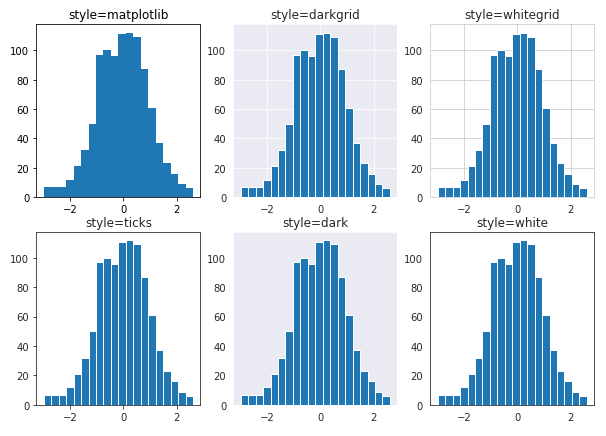

相比matplotlib绘图风格，seaborn绘制的直方图会自动增加空白间隔，图像更为清爽。而不同seaborn风格间，则主要是绘图背景色的差异。

2. 环境设置
设置环境的方法也有3种：
- set，通用设置接口
- set_context，环境设置专用接口，设置后全局绘图环境随之改变
- plotting_context，设置当前图（axes级）的绘图环境，同时返回设置后的环境系列参数，支持with关键字用法

当前支持的绘图环境主要有4种：
- notebook，默认环境
- paper
- talk
- poster
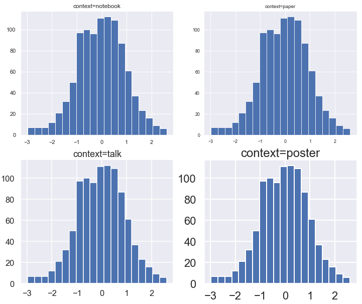

可以看出，4种默认绘图环境最直观的区别在于字体大小的不同，而其他方面也均略有差异。详细对比下4种绘图环境下的系列参数设置：

## 03 颜色设置
seaborn风格多变的另一大特色就是支持个性化的颜色配置。颜色配置的方法有多种，常用方法包括以下两个：
- color_palette，基于RGB原理设置颜色的接口，可接收一个调色板对象作为参数，同时可以设置颜色数量
- hls_palette，基于Hue(色相)、Luminance(亮度)、Saturation(饱和度)原理设置颜色的接口，除了颜色数量参数外，另外3个重要参数即是hls

同时，为了便于查看调色板样式，seaborn还提供了一个专门绘制颜色结果的方法palplot。
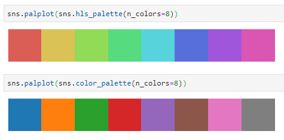
hls_palette提供了均匀过渡的8种颜色样例
而color_palette则只是提供了8种不同颜色

## 04 数据集
seaborn自带了一些经典的数据集，用于基本的绘制图表示例数据。在联网状态下，可通过load_dataset()接口进行获取，首次下载后后续即可通过缓存加载。返回数据集格式为Pandas.DataFrame对象。

当前内置了10几个数据集，常用的经典数据集如下：
- iris：鸢尾花，与sklearn中数据集一致，仅有数值型数据
- tips：小费，主要是中餐和晚餐的数据集，既有分类数据也有数值数据，可用于探索数据间的回归关系
- titanic：泰坦尼克，经典数据集
本文后续所有绘图主要基于前2个数据集完成。

## 05 常用绘制图表
seaborn内置了大量集成绘图接口，往往仅需一行代码即可实现美观的图表结果。按照数据类型，大体可分为连续性（数值变量）和离散型（分类数据）两类接口。

### 数值变量
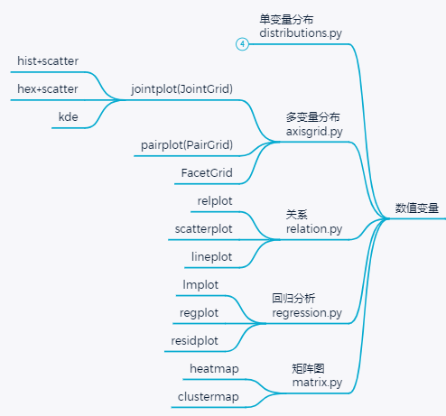
1. 单变量分布
变量分布可用于表达一组数值的分布趋势，包括集中程度、离散程度等。seaborn中提供了3种表达单变量分布的绘图接口
- distplot
distribution+plot，接口内置了直方图（histogram）、核密度估计图（kde，kernel density estimation）以及rug图（直译为地毯，绘图方式就是将数值出现的位置原原本本的以小柱状的方式添加在图表底部），3种图表均可通过相应参数设置开关状态，默认情况下是绘制hist+kde。
distplot支持3种格式数据：pandas.series、numpy中的1darray以及普通的list类型。以鸢尾花数据为例，并添加rug图可得如下图表：
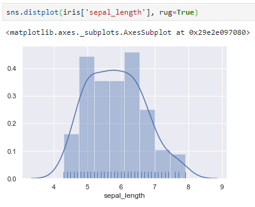

- kdeplot
kdeplot是一个专门绘制核密度估计图的接口，虽然distplot中内置了kdeplot图表，并且可通过仅开启kde开关实现kdeplot的功能，但kdeplot实际上支持更为丰富的功能，比如当传入2个变量时绘制的即为热力图效果。

仍以鸢尾花为例，绘制双变量核密度估计图，并添加阴影得到如下图表：
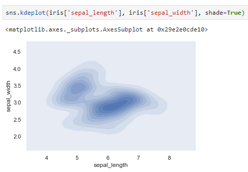

- rugplot
这是一个不太常用的图表类型，其绘图方式比较朴素：即原原本本的将变量出现的位置绘制在相应坐标轴上，同时忽略出现次数的影响。
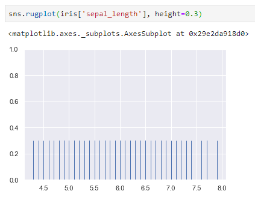

2. 多变量分布
单变量分布仅可用于观察单一维度的变化关系，为了探究多变量间分布关系时，如下绘图接口更为有效：

- jointplot
joint意为联合，顾名思义jointplot是一个双变量分布图表接口。绘图结果主要有三部分：绘图主体用于表达两个变量对应的散点图分布，在其上侧和右侧分别体现2个变量的直方图分布：
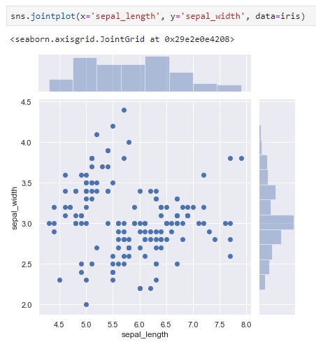

- pairplot
当变量数不止2个时，pairplot是查看各变量间分布关系的首选。它将变量的任意两两组合分布绘制成一个子图，对角线用直方图、而其余子图用相应变量分别作为x、y轴绘制散点图。显然，绘制结果中的上三角和下三角部分的子图是镜像的。
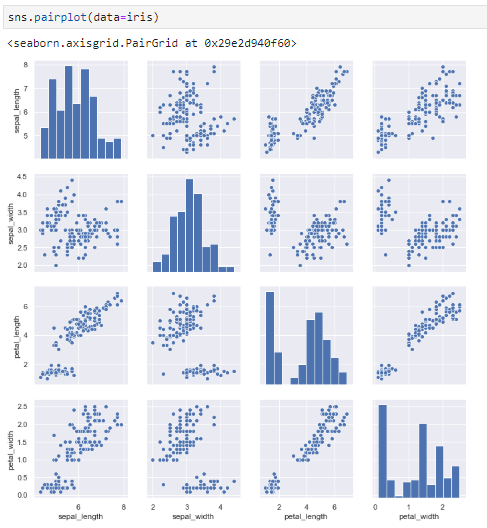

实际上，查看seaborn源码可以发现，其绘图接口大多依赖于一个类实现。例如：jointplot在seaborn中实际上先实现了一个名为JointGrid的类，然后在调用jointplot时即是调用该类实现。相比之下，JointGrid可以实现更为丰富的可定制绘图接口，而jointplot则是其一个简单的样例实现。类似地，pairplot则是依赖于PairGrid类实现。

例如，如下案例调用了PairGrid类实现，与标准pairplot不同的是上三角子图选用了kde图表，效果更为丰富。
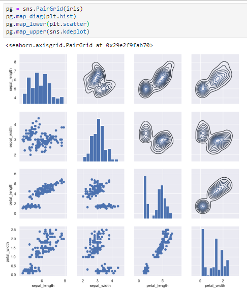

与此同时，seaborn中的绘图接口虽然大多依赖于相应的类实现，但却并未开放所有的类接口。实际上，可供用户调用的类只有3个，除了前面提到的`JointGrid`和`PairGrid`外，还有一个是`FacetGrid`，它是一个seaborn中很多其他绘图接口的基类。

3. 关系型图表
seaborn还提供了几个用于`表达双变量关系`的图表，主要包括点图和线图两类。主要提供了3个接口，relplot(relation+plot)、scatterplot和lineplot，其中relplot为figure-level（可简单理解为操作对象是matplotlib中figure），而后两者是axes-level（对应操作对象是matplotlib中的axes），但实际上接口调用方式和传参模式都是一致的，其核心参数主要包括以下4个：
- - data，pandas.dataframe对象，后面的x、y和hue均为源于data中的某一列值
- - x，绘图的x轴变量
- - y，绘图的y轴变量
- - hue，区分维度，一般为分类型变量
同时，relplot可通过kind参数选择绘制图表是scatter还是line类型。默认为scatter类型。

- relplot
仍以鸢尾花数据集为例，绘制不同种类花的两变量散点图如下：
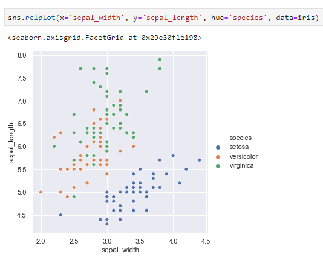

- scatterplot
也可实现同样的散点图效果:
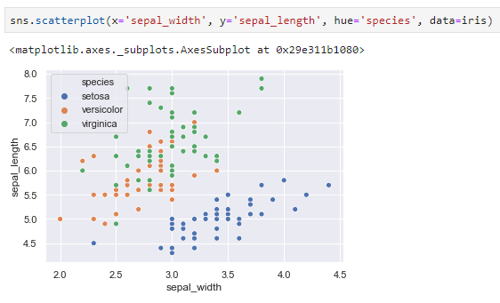

- lineplot
lineplot不同于matplotlib中的折线图，会将同一x轴下的多个y轴的统计量（默认为均值）作为折线图中的点的位置，并辅以阴影表达其置信区间。可用于快速观察点的分布趋势。
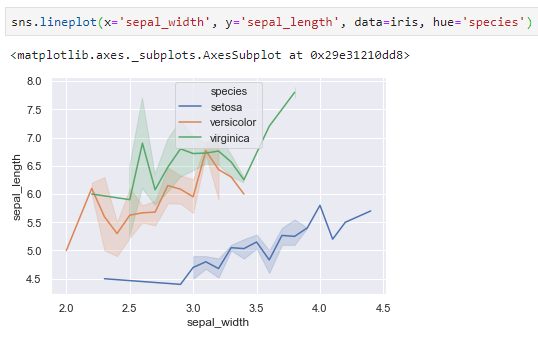

4. 回归分析
在查看双变量分布关系的基础上，seaborn还提供了简单的回归接口。另外，还可设置回归模型的阶数，例如设置order=2时可以拟合出抛物线型回归线。

- regplot
基础回归模型接口，即regression+plot。绘图结果为散点图+回归直线即置信区间。另外，还可通过logistic参数设置是否启用逻辑回归。
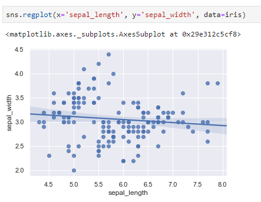

- residplot
residplot提供了拟合后的残差分布图，相当于先执行lmplot中的回归拟合，而后将回归值与真实值相减结果作为绘图数据。直观来看，当残差结果随机分布于y=0上下较小的区间时，说明具有较好的回归效果。
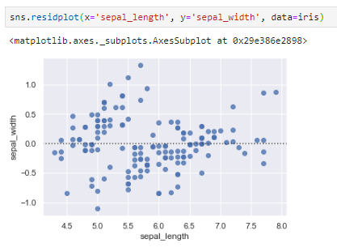

- lmplot
`lmplot=regplot+FacetGrid`，也是用于绘制回归图表，但功能相比更为强大，除了增加hue参数支持分类回归外，还可添加row和col参数（二者均为FacetGrid中的常规参数，用于添加多子图的行和列）实现更多的分类回归关系。这里以seaborn中的小费数据集进行绘制，得到如下回归图表：
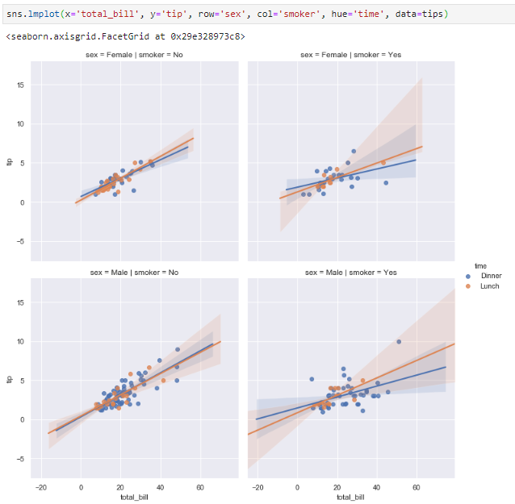

5. 矩阵图
矩阵图主要用于表达一组数值型数据的大小关系，在探索数据相关性时也较为实用。

- heatmap
原原本本的将一组数据以热力图矩阵的形式展现出来，同时可通过设置数值上下限和颜色板实现更为美观的效果。如下图表展示了鸢尾花数据集中各变量间的相关系数，从中可以很容易看出`sepal_length、petal_length、petal_width`三者之间彼此呈现较强的相关性，而sepal_width则与它们相关性不大。
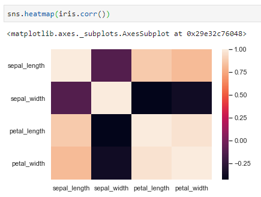

- clustermap
在heatmap的基础上，clustermap进一步挖掘各行数据间的相关性，并逐一按最小合并的原则进行聚类，给出了聚类后的热力图：
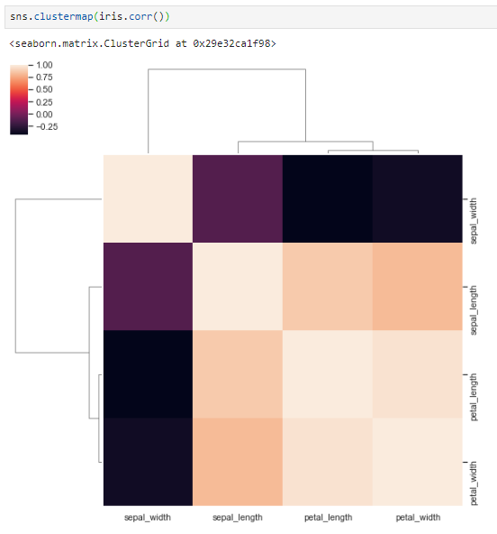

## 分类数据
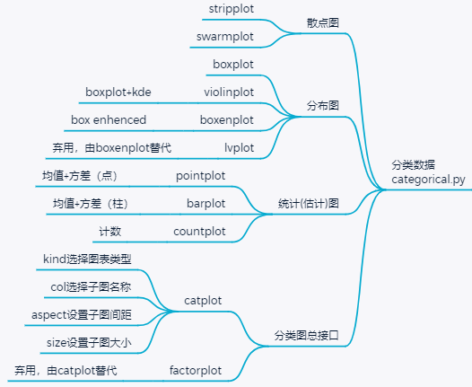

1. 散点图
分类数据散点图接口主要用于当一列数据是分类变量时。相比于两列数据均为数值型数据，可以想象分类数据的散点图将会是多条竖直的散点线。绘图接口有`stripplot`和`swarmplot`两种，常用参数是一致的，主要包括：
- - x，散点图的x轴数据，一般为分类型数据
- - y，散点图的y轴数据，一般为数值型数据
- - hue，区分维度，相当于增加了第三个参数
- - data，pandas.dataframe对象，以上几个参数一般为data中的某一列

- stripplot
常规的散点图接口，可通过jitter参数开启散点左右"抖动"效果（实际即为在水平方向上加了一个随机数控制x坐标，默认jitter=True；当设置jitter为False时，散点图均严格位于一条直线上）
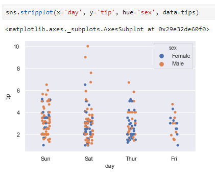

- swarmplot
在stripplot的基础上，不仅将散点图通过抖动来实现相对分离，而且会严格讲各散点一字排开，从而便于直观观察散点的分布聚集情况：
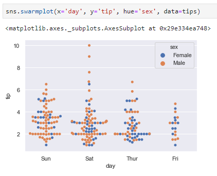

2. 分布图
与数值型变量分布类似，seaborn也提供了几个分类型数据常用的分布绘图接口。且主要参数与前述的散点图接口参数是十分相近的。

- boxplot
箱线图，也叫盒须图，表达了各分类下数据4分位数和离群点信息，常用于查看数据异常值等。
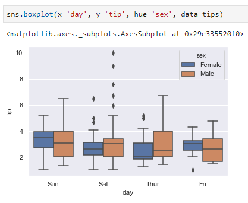
从各日期的小费箱线图中可以看出，周六这一天小费数值更为离散，且男性的小费数值随机性更强；而其他三天的小费数据相对更为稳定。

- boxenplot
是一个增强版的箱线图，即box+enhenced+plot，在标准箱线图的基础上增加了更多的分位数信息，绘图效果更为美观，信息量更大。
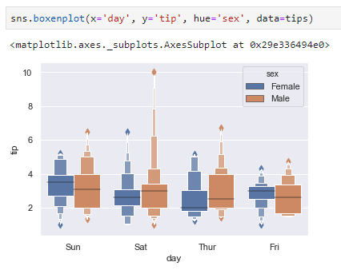

- lvplot
lvplot=letter value+plot，是boxenplot的前身，绘图效果与后者一致。现已被boxenplot所替代，不再提倡使用。

- violinplot
小提琴图，相当于boxplot+kdeplot，即在标准箱线图的基础上增加了kde图的信息，从而可更为直观的查看数据分布情况。因其绘图结果常常酷似小提琴形状，因而得名violinplot。在hue分类仅有2个取值时，还可通过设置split参数实现左右数据合并显示。
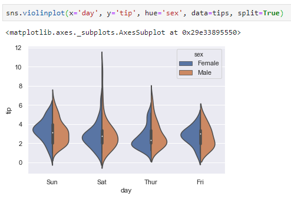

3. 统计(估计)图

- pointplot
pointplot给出了数据的统计量（默认统计量为均值）和相应置信区间（confidence intervals，默认值为95%，即参数ci=95），并以相应的点和线进行绘图显示：
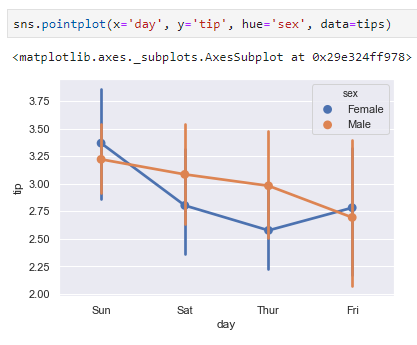

- barplot
与pointplot用折线表达统计量变化不同，barplot以柱状图表达统计量，而置信区间则与前者一致，仅仅是适用场景不同而已。
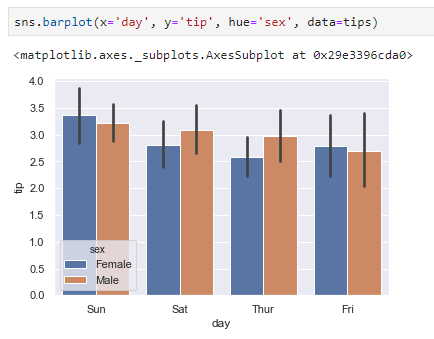

`注：当x轴分类变量为连续日期数据时，选用pointplot得到的绘图意义更为明确；而对于其他分类型变量，则选用barplot更为合适。`

- countplot
这是一个功能比较简单的统计图表，仅用于表达各分类值计数，并以柱状图的形式展现：
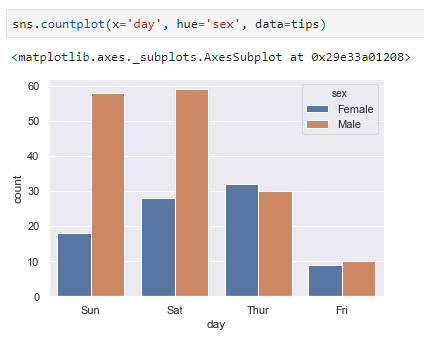

4. figure-level分类绘图总接口
最后，seaborn还提供了一个用于分类数据绘图的figure-level接口catplot，catplot与其他分类数据绘图接口的关系相当于lmplot与regplot的关系；同时catplot中还可通过kind参数实现前面除countplot外的所有绘图接口，功能更为强大。kind默认为strip，此时等效于stripplot接口。

- catplot
catplot=category+plot，用其实现分类条件下小提琴图。
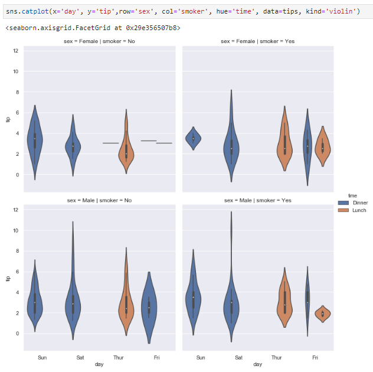

- factorplot
factorplot是catplot的前身，二者实现功能完全一致，现已被后者更名替代，官方不再推荐使用。

另外，seaborn中还提供了一个时序数据绘图接口tsplot，个人用的较少。

## 06 小结
最后简要总结seaborn制作可视化图表的几个要点：
- 绝大多数绘图接口名字均为XXXXplot形式
- 绘图数据对象主要区分连续型的数值变量和离散型的分类数据
- 绘图接口中的传参类型以pandas.dataframe为主，当提供了dataframe对象作为data参数后，x、y以及hue即可用相应的列名作为参数，但也支持numpy的数组类型和list类型
- 绘图接口底层大多依赖一个相应的类来实现，但对外开放的只有3个类：PairGrid、JointGrid和FacetGrid
- 接口包括了常用的分布、关系、统计、回归类图表
- 可灵活设置绘图风格、环境和颜色

[各类型具体使用](https://blog.csdn.net/qq_42676511/article/details/125178293)
